# Adaptive Data Pipeline Agent — 系统架构设计

## 1. 项目概述

设计一个通用的、LLM 驱动的数据代理，数据工程师可以通过自然语言与之交互，构建、监控和修复数据管道。

### 核心设计原则

- **LLM 驱动**：schema 推理、质量评估、恢复决策来自语言模型，而非硬编码规则
- **工具暴露为结构化接口**：通过 MCP / function-calling / tool-use API
- **处理未预见的数据源和质量 problems**：不针对特定文件或 API 编写确定性脚本
- **数据血缘追踪**：从原始数据源到最终输出的完整溯源

## 2. 系统架构

### 2.1 三层架构

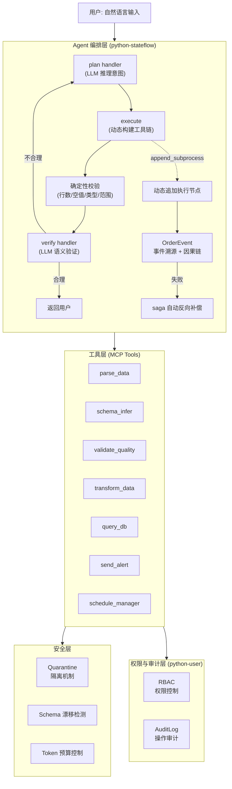

### 2.2 核心循环

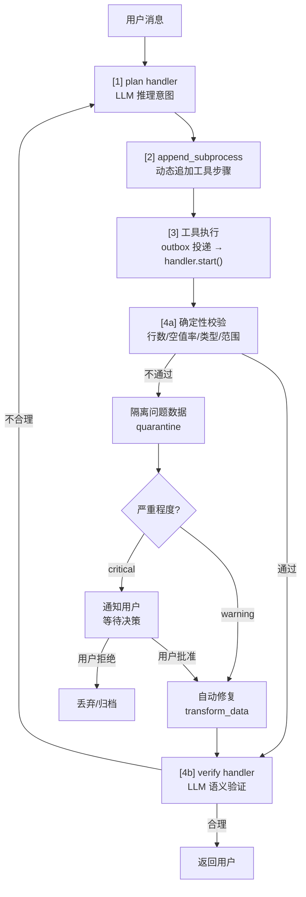

### 2.3 与 python-stateflow 的映射

| Agent 概念 | stateflow 实现 |
|-----------|---------------|
| 对话上下文 | `Order.context` (JSON 字段) |
| 推理步骤 | `OrderSubProcess` (每个步骤一个) |
| 动态工具链 | `append_subprocess()` 运行时追加 |
| 工具调用 | `SyncSubProcessHandler.start()` |
| 失败补偿 | `handler.rollback()` + saga 反向清理 |
| 执行历史 | `OrderEvent` 事件溯源 (因果链) |
| 幂等重试 | `event_key` 去重 |
| 并发安全 | `OptimisticLockMixin` 乐观锁 |

### 2.4 实现方案：动态线性编排

> **Design Decision:** 我们选择动态线性编排而非 DAG，原因：
> 1. 数据管道工具天然有顺序依赖（parse → validate → transform），并行收益有限
> 2. LLM 输出是线性的，推断依赖关系成本高、准确率低
> 3. 线性流程已覆盖 90% 的实际场景

#### 2.4.1 当前实现：线性循环

```python
# core/__init__.py — 实际代码
class PipelineAgent:
    def run(self, user_input: str, session: Session) -> str:
        messages = [system_prompt, *history, user_input]
        response = self._call_llm(messages)

        # Dynamic linear: LLM returns tools, we execute in order
        while "```tool" in response:
            tool_name, tool_args, response = self._extract_tool_call(response)
            result = self._execute_tool(tool_name, tool_args, session)
            # Feed result back to LLM for next step
            response = self._call_llm(messages + [assistant, tool_result])

        return response
```

**特点：**
- LLM 决定工具链（动态），代码按顺序执行（线性）
- 每步执行后将结果反馈给 LLM，由 LLM 决定下一步
- 无需预定义工具依赖，完全由 LLM 推理

#### 2.4.2 改进方案：stateflow 线性编排（可选，1 天）

```python
# 设计方案：用 stateflow 结构化线性流程
from rhosocial.stateflow import StateMachine, SyncSubProcessHandler, HandlerResult

class PipelineStepHandler(SyncSubProcessHandler):
    """Wraps a Tool call as a stateflow subprocess."""

    def __init__(self, tool_name: str, tool_args: dict):
        self.tool_name = tool_name
        self.tool_args = tool_args

    def start(self) -> HandlerResult:
        tool = get_tool(self.tool_name)
        result = tool.run(**self.tool_args)
        return HandlerResult(
            status="completed" if result.get("status") == "ok" else "failed",
            payload=result,
        )

    def rollback(self) -> HandlerResult:
        tool = get_tool(self.tool_name)
        if hasattr(tool, 'rollback'):
            tool.rollback(self.tool_args)
        return HandlerResult(status="rollback_complete")


def build_linear_pipeline(tool_calls: list[dict]) -> StateMachine:
    """Build a linear pipeline from LLM tool calls."""
    sm = StateMachine("pipeline")
    for i, call in enumerate(tool_calls):
        handler = PipelineStepHandler(call["name"], call["args"])
        sm.append_subprocess(f"step_{i}", handler)
    return sm
```

**相比原始循环的改进：**

| 能力 | 原始循环 | stateflow 线性 |
|------|---------|---------------|
| 上下文传递 | 手动拼 messages | `Order.context` 自动传递 |
| 事件记录 | 手动 session.log() | `OrderEvent` 自动记录 |
| 错误处理 | try/except | 统一 rollback 接口 |
| 执行追踪 | 无 | 每步有 subprocess 状态 |
| 幂等重试 | 手动实现 | `event_key` 去重 |

**实现成本：** 1 天（handler 包装 + 测试）

#### 2.4.3 未来方案：动态 DAG（如需并行）

> 仅在工具间存在可并行执行的独立子任务时才需要 DAG。

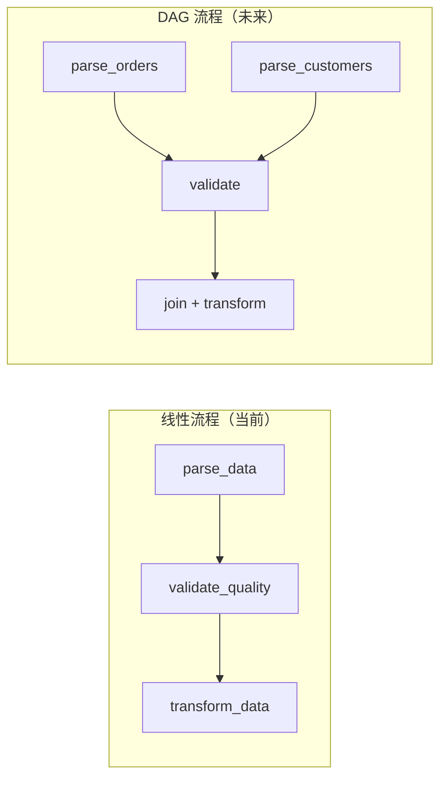

**何时需要 DAG：**
- 多数据源并行解析（parse_orders + parse_customers 可并行）
- 独立验证（validate_quality + schema_infer 可并行）
- 当前 6 个工具的场景下，几乎不会出现

### 3.1 工具清单

| 工具 | handler_class | 输入 | 输出 | 对应能力 |
|------|--------------|------|------|---------|
| parse_data | `handlers.ParseDataHandler` | 数据源 (文件/URL) | 结构化数据 + schema | 多格式解析 |
| schema_infer | `handlers.SchemaInferHandler` | 数据源 | schema 定义 + 字段类型 + 约束 | Schema 推理 |
| validate_quality | `handlers.ValidateQualityHandler` | 数据 + 规则 | 质量报告 + 问题列表 | 质量评估 |
| transform_data | `handlers.TransformDataHandler` | 数据 + 转换规则 | 转换后数据 | 数据清洗 |
| query_db | `handlers.QueryDBHandler` | ORM 操作 (7 种模式) | 查询/分析结果 | 数据库查询与操作 |
| send_alert | `handlers.SendAlertHandler` | 告警内容 + 接收方 | 发送确认 | 告警通知 |

### 3.2 工具注册

所有工具通过 handler 注册表注册，支持两种解析方式：

```python
# 显式注册 (推荐)
registry.register("parse_data", ParseDataHandler)
registry.register("schema_infer", SchemaInferHandler)

# 动态导入 (可选，用于配置化场景)
# handler_class="mypackage.handlers.ParseDataHandler"
```

### 3.3 工具接口规范

每个工具 handler 遵循统一接口：

```python
class ParseDataHandler(SyncSubProcessHandler):
    def start(self) -> HandlerResult:
        # 1. 从 subprocess.context 获取参数
        # 2. 执行工具逻辑
        # 3. 返回 HandlerResult(status="parsed", payload={...})
        ...

    def rollback(self) -> HandlerResult:
        # 解析操作无需回滚，返回空结果
        return HandlerResult(status="rollback_complete")
```

### 3.4 Embedding 工具检索（已实现）

当工具数量增多时，LLM 直接推理效率下降。采用 pg_vector 实现向量检索预筛选：

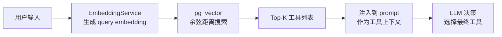

**实现方式：**
- 使用 `rhosocial-activerecord-postgres` 的 `PostgresVectorType`
- 工具描述 + 关键词 embedding 存储在 `tool_embeddings` 表
- 查询时使用 pg_vector 的 `<=>` 操作符进行余弦距离搜索
- 返回 Top-3 最相关工具，注入到 prompt 中

**扩展性：**
- 生产环境可替换为 OpenAI/Cohere 等 embedding 模型
- 支持工具描述更新后重新索引
- 支持按相似度阈值过滤

## 4. 异常处理策略

### 4.0 LLM API 异常处理

LLM 服务是系统的核心依赖，其可用性直接影响整个 Agent 的稳定性。

#### 异常分类

| 错误类型 | 典型错误码 | 处理策略 |
|---------|-----------|---------|
| **限流** | 429 Too Many Requests | 指数退避重试，最多 3 次 |
| **服务不可用** | 503 Service Unavailable | 切换备用模型，通知用户 |
| **内部错误** | 500 Internal Server Error | 重试 1 次，失败后降级 |
| **Token 配额耗尽** | 402/429 (quota) | 切换备用模型或等待 |
| **上下文超长** | 400 (context_length) | 截断历史上下文，重试 |
| **认证失败** | 401 Unauthorized | 终止并通知用户检查配置 |
| **网络超时** | timeout | 重试 1 次，缩短 max_tokens |

#### 模型降级链

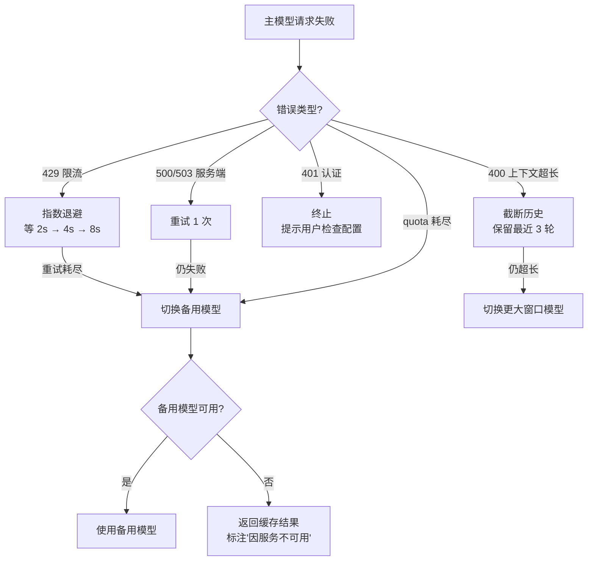

#### 备用模型配置

```python
FALLBACK_CHAIN = [
    "mimo-v2.5",           # 主模型
    "qwen3.8-flash",       # 备用 1
    "glm-5.3-flash",       # 备用 2
    "hy3",                 # 备用 3
]
```

#### 重试策略实现

```python
import httpx
import time

MAX_RETRIES = 3
RETRY_DELAY_BASE = 2  # 秒

def call_llm_with_retry(messages, model, base_url, api_key):
    for attempt in range(MAX_RETRIES):
        try:
            resp = httpx.post(
                f"{base_url}/chat/completions",
                headers={"Authorization": f"Bearer {api_key}"},
                json={"model": model, "messages": messages},
                timeout=60,
            )

            if resp.status_code == 200:
                return resp.json()["choices"][0]["message"]["content"]

            if resp.status_code == 429:
                delay = RETRY_DELAY_BASE * (2 ** attempt)
                time.sleep(delay)
                continue

            if resp.status_code in (500, 503):
                if attempt < MAX_RETRIES - 1:
                    time.sleep(RETRY_DELAY_BASE)
                    continue
                # 切换备用模型
                return call_llm_with_fallback(messages)

            if resp.status_code == 401:
                return "[认证失败] 请检查 DPA_API_KEY 配置"

            return f"[LLM 错误] {resp.status_code}: {resp.text[:200]}"

        except httpx.TimeoutException:
            if attempt < MAX_RETRIES - 1:
                time.sleep(RETRY_DELAY_BASE)
                continue
            return call_llm_with_fallback(messages)

    return "[LLM 不可用] 所有重试和备用模型均失败"
```

#### 降级输出策略

当 LLM 完全不可用时，系统应降级而非崩溃：

| 场景 | 降级策略 |
|------|---------|
| 工具调用结果验证 | 跳过 LLM 验证，仅执行确定性校验 |
| Schema 推理 | 使用缓存的 schema 基线，标注'未验证' |
| 数据质量评估 | 仅返回确定性检查结果 |
| 用户对话 | 返回已收集的结果 + '因 LLM 服务不可用，部分分析未完成' |

### 4.1 异常分类

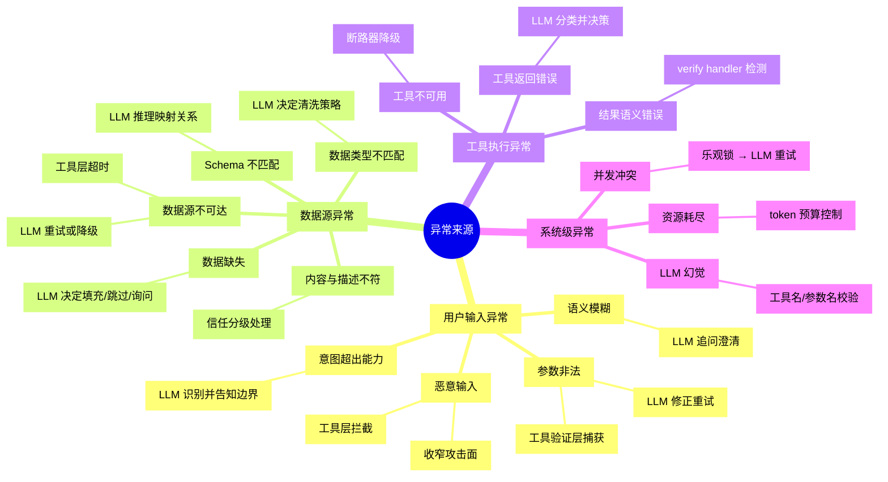

### 4.2 错误恢复决策树

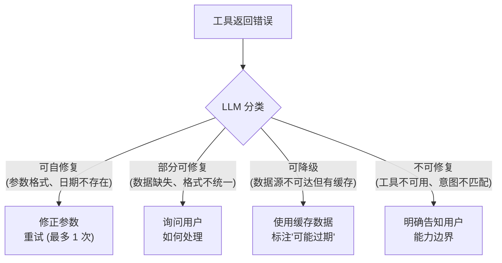

### 4.3 信任分级

| 信任层级 | 典型来源 | 操作权限 |
|---------|---------|---------|
| 高 | 自建工具 (schedule-manager)、参数化 SQL | 可执行有副作用操作 |
| 中 | 经校验的外部 API、可信域名内容 | 只读，写操作需确认 |
| 低 | 未知来源文档、用户粘贴文本 | 仅参考，不驱动操作 |

## 5. 数据血缘

### 5.1 血缘记录

基于 stateflow 的 OrderEvent 实现：

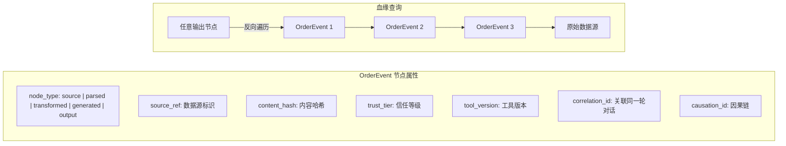

### 5.2 血缘查询

给定任意输出节点，反向遍历 OrderEvent 链，得到完整的数据来源和处理路径。

### 5.3 血缘与传统 ETL 的区别

传统 ETL 的血缘是字段级映射 (确定性)。LLM 场景下，模型综合生成的文本无法精确到字段级。采用两层策略：

- **结构化操作** (SQL 查询、数据转换): 代码层面精确记录来源
- **LLM 生成** (总结、分析): 要求模型标注依赖的输入节点 ID (尽力而为)

## 6. Schema 漂移检测

### 6.1 Schema 基线管理

每次成功解析数据源时，持久化 schema 快照作为基线：

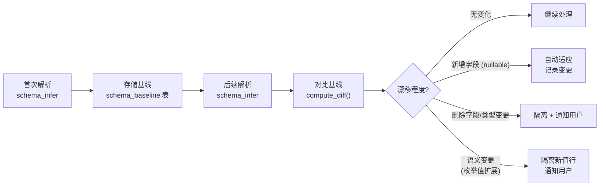

**基线存储结构** (SchemaBaseline 表)：

| 字段 | 类型 | 说明 |
|------|------|------|
| id | int | 主键 |
| source_ref | str | 数据源标识 (URL/文件路径) |
| schema_json | jsonb | 完整 schema 定义 |
| content_hash | str | schema 内容哈希 |
| created_at | timestamp | 创建时间 |
| is_current | bool | 是否为当前基线 |

### 6.2 漂移检测算法

```python
def compute_schema_diff(baseline: dict, current: dict) -> SchemaDiff:
    """对比基线 schema 与当前 schema，返回漂移报告"""
    diff = SchemaDiff()

    baseline_fields = {f["name"]: f for f in baseline["fields"]}
    current_fields = {f["name"]: f for f in current["fields"]}

    # 新增字段
    for name in current_fields - baseline_fields:
        diff.added.append(FieldDiff(name=name, type=current_fields[name]["type"]))

    # 删除字段
    for name in baseline_fields - current_fields:
        diff.removed.append(FieldDiff(name=name, type=baseline_fields[name]["type"]))

    # 类型变更
    for name in baseline_fields & current_fields:
        if baseline_fields[name]["type"] != current_fields[name]["type"]:
            diff.type_changed.append(FieldDiff(
                name=name,
                old_type=baseline_fields[name]["type"],
                new_type=current_fields[name]["type"],
            ))

    # 语义变更 (枚举值扩展)
    for name in baseline_fields & current_fields:
        old_vals = set(baseline_fields[name].get("unique_values", []))
        new_vals = set(current_fields[name].get("unique_values", []))
        if new_vals - old_vals:
            diff.semantic_changed.append(FieldDiff(
                name=name,
                added_values=list(new_vals - old_vals),
            ))

    return diff
```

### 6.3 漂移严重程度

| 级别 | 条件 | 处理 |
|------|------|------|
| **无漂移** | schema 完全一致 | 继续处理 |
| **兼容漂移** | 仅新增 nullable 字段 | 自动适应，记录变更日志 |
| **警告漂移** | 枚举值扩展、格式微调 | 记录变更，继续处理，通知用户 |
| **破坏漂移** | 字段删除、类型变更、非空约束变更 | 隔离数据，必须用户确认后继续 |

## 7. 隔离机制 (Quarantine)

### 7.1 隔离架构

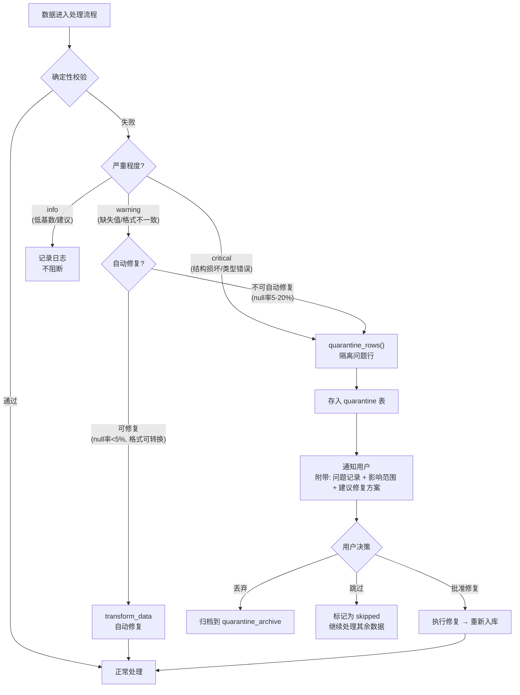

### 7.2 隔离存储 (Quarantine 表)

| 字段 | 类型 | 说明 |
|------|------|------|
| id | int | 主键 |
| order_id | int | 关联的 stateflow Order |
| source_ref | str | 数据源标识 |
| row_data | jsonb | 被隔离的原始行数据 |
| issue_type | str | 问题类型 (null_value/type_error/format_mismatch/...) |
| issue_column | str | 问题所在列 |
| severity | str | 严重程度 (critical/warning) |
| detected_by | str | 检测方式 (deterministic/llm/schema_drift) |
| suggestion | str | 建议修复方案 |
| status | str | 状态 (pending/approved/rejected/archived) |
| resolved_at | timestamp | 解决时间 |
| resolved_by | str | 解决者 (user/system) |

### 7.3 决策规则矩阵

| 问题类型 | 严重程度 | 自动修复 | 隔离 | 升级用户 |
|---------|---------|---------|------|---------|
| 空值率 <5% | warning | ✅ 填充均值/中位数 | | |
| 空值率 5-20% | critical | | ✅ 隔离问题行 | ✅ 通知 |
| 空值率 >20% | critical | | ✅ 隔离 | ✅ 必须决策 |
| 类型错误 <10 行 | warning | ✅ 尝试转换 | | |
| 类型错误 >10 行 | critical | | ✅ 隔离 | ✅ 通知 |
| Schema 字段删除 | critical | | ✅ 隔离全列 | ✅ 必须确认 |
| Schema 字段新增 | info | ✅ 设为 nullable | | |
| 语义变更 (枚举扩展) | warning | | ✅ 隔离新值行 | ✅ 通知 |
| 数据源不可达 | critical | ✅ 使用缓存 | | ✅ 标注"可能过期" |
| 日期不存在 | warning | ✅ 追问用户修正 | | |

## 8. 静默损坏防护

### 8.1 三层防护体系

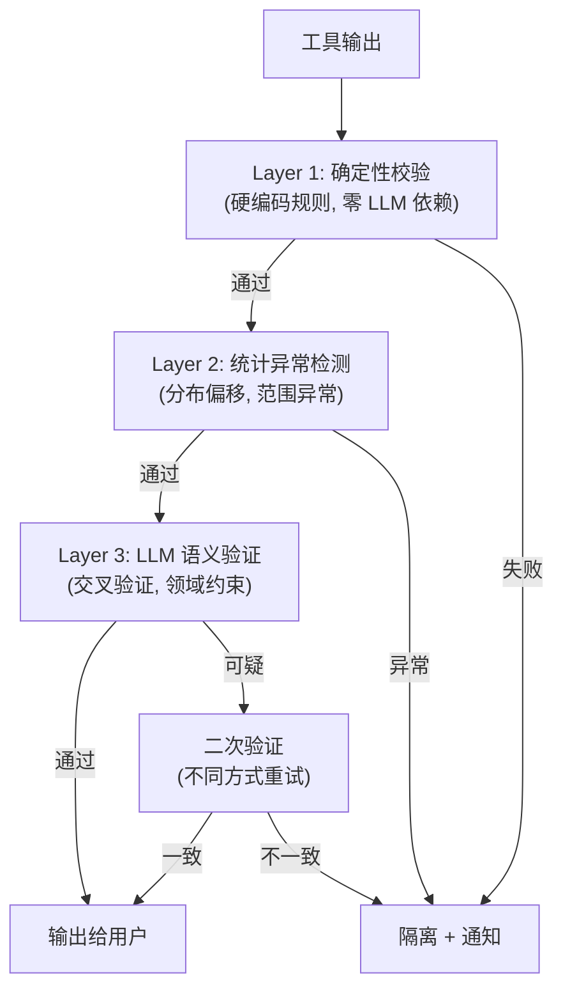

### 8.2 Layer 1: 确定性校验 (零 LLM 依赖)

这是防止静默损坏的最后一道硬防线，不依赖 LLM 判断：

| 检查项 | 规则 | 触发条件 |
|--------|------|---------|
| 行数边界 | `output_rows >= input_rows * 0.5` 且 `output_rows <= input_rows * 2` | 非过滤操作后 |
| 空值率 | `output_null_rate <= input_null_rate` | 转换操作后 |
| NaN/Inf | 输出中无 NaN/Inf 值 | 数值列转换后 |
| Schema 一致 | 输出列集合 == 预期列集合 | 所有操作后 |
| 主键唯一 | 主键列无重复 | 写入操作前 |
| 外键完整 | 外键值在引用表中存在 | 写入操作前 |

```python
class DeterministicValidator:
    """确定性校验器 — 不调用 LLM，纯规则执行"""

    def validate(self, input_data, output_data, operation) -> ValidationResult:
        result = ValidationResult()

        # 行数边界 (除非操作明确是过滤)
        if operation.type != "filter":
            ratio = len(output_data) / max(len(input_data), 1)
            if ratio < 0.5 or ratio > 2.0:
                result.add_issue("row_count_anomaly",
                    f"行数变化异常: {len(input_data)} → {len(output_data)} (比率 {ratio:.2f})")

        # 空值率检查
        for col in output_data.columns:
            in_null = input_data.null_rate(col)
            out_null = output_data.null_rate(col)
            if out_null > in_null + 0.05:  # 允许 5% 浮动
                result.add_issue("null_rate_increase",
                    f"列 {col} 空值率增加: {in_null:.1%} → {out_null:.1%}")

        # NaN/Inf 检查
        for col in output_data.numeric_columns:
            if output_data.has_nan_or_inf(col):
                result.add_issue("nan_inf_detected", f"列 {col} 包含 NaN/Inf")

        return result
```

### 8.3 Layer 2: 统计异常检测

| 检测项 | 方法 | 阈值 |
|--------|------|------|
| 值分布偏移 | KL 散度 / JS 散度 | KL > 0.1 触发警告 |
| 范围异常 | min/max 超出预期范围 | revenue < 0 触发警告 |
| 均值偏移 | 输出均值与输入均值差异 | 偏差 > 30% 触发警告 |
| 行数倍增 | JOIN 后行数膨胀 | 膨胀 > 5x 触发警告 |

### 8.4 Layer 3: LLM 语义验证

verify handler 的具体验证清单：

```python
VERIFY_CHECKLIST = """
在验证工具输出时，检查以下项目：

1. 数据合理性:
   - 输出行数是否与预期一致？（大量减少或增加是否合理？）
   - 数值列的范围是否合理？（日期应在合理时间范围内，金额应非负）
   - 枚举列的值是否都在合法集合内？

2. 语义一致性:
   - 输出是否回答了用户的问题？
   - 结果是否自相矛盾？（如同一记录在不同查询中状态不同）
   - 汇总数据与明细数据是否一致？

3. 跨字段一致性:
   - start_time < due_time 是否成立？
   - total = sum(sub_items) 是否成立？
   - 状态转换是否合法？（如不能从 completed 直接到 pending）

4. 边界检查:
   - 结果集是否为空？如果是，是否合理？
   - 是否有截断？截断是否影响结论？
"""
```

## 9. Token 预算控制（已实现）

### 9.1 预算分配

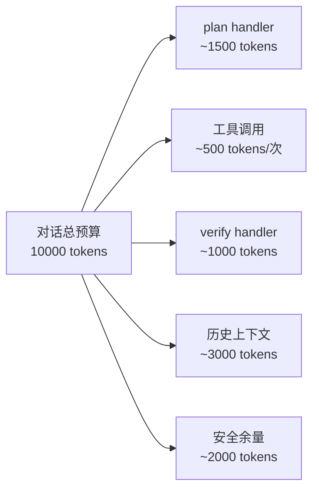

**实现：** `token_budget.py` 中的 `TokenBudget` 类

### 9.2 预算控制策略（已实现）

| 阶段 | 策略 | 实现状态 |
|------|------|---------|
| 对话开始 | 分配预算 | ✅ TokenBudget 初始化 |
| 每轮开始 | 检查剩余 | ✅ `can_afford()` 方法 |
| 工具调用前 | 预估消耗 | ✅ `consume()` 方法 |
| 收尾模式 | 截断历史 | ✅ `truncate_history()` 方法 |
| 预算耗尽 | 强制结束 | ✅ `phase == "exhausted"` 检查 |

### 9.3 降级策略（已实现）

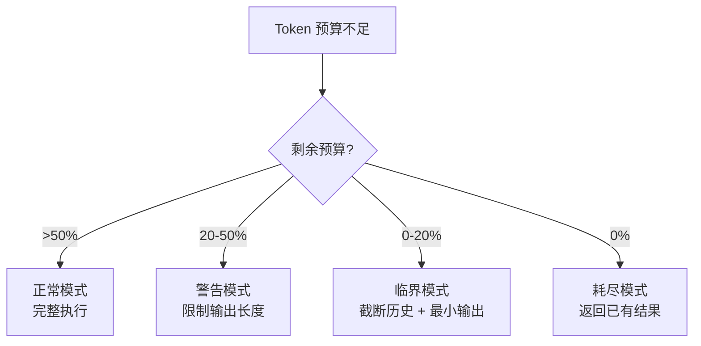

**阶段检测：**
- `normal`: remaining > 50%
- `warning`: 20% < remaining <= 50%
- `critical`: 0% < remaining <= 20%
- `exhausted`: remaining = 0%

## 10. 反馈闭环

### 10.1 反馈收集

| 反馈类型 | 来源 | 记录方式 |
|---------|------|---------|
| 显式纠正 | 用户说"这个不对" | 标记为 feedback_correction |
| 隐式放弃 | 用户重新提问同样的问题 | 标记为 feedback_reask |
| 满意确认 | 用户说"谢谢"/"完成了" | 标记为 feedback_positive |
| 工具建议 | 用户建议新工具/新功能 | 标记为 feedback_feature |

### 10.2 反馈闭环流程

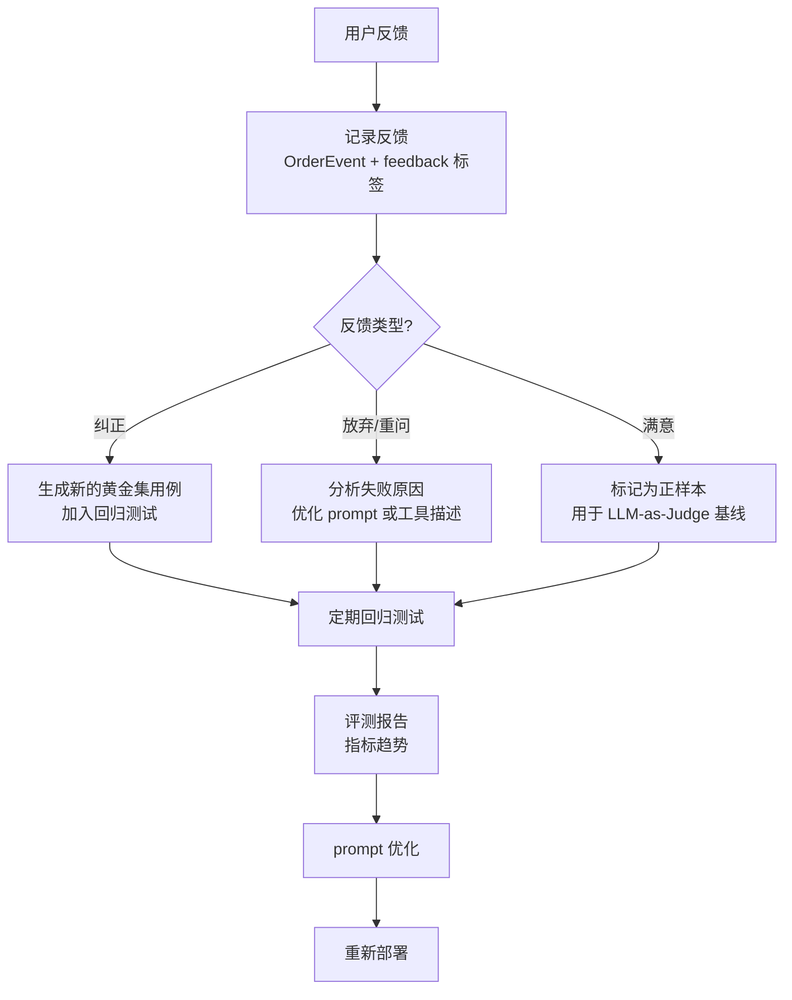

### 10.3 反馈驱动的优化

| 反馈模式 | 优化动作 |
|---------|---------|
| 同一类工具选择错误反复出现 | 优化该工具的描述和"何时使用"说明 |
| 同一类参数提取错误反复出现 | 在 prompt 中增加该参数的提取示例 |
| 用户频繁纠正同一类结果 | 增加该场景的确定性校验规则 |
| 某工具的 quarantine 率过高 | 审查工具实现或调整阈值 |

## 11. Prompt 管理

### 11.1 Prompt 分层

| Prompt | 位置 | 版本控制 | 测试 |
|--------|------|---------|------|
| plan_handler_prompt | llm_bridge.py | ✅ 独立文件 + 版本号 | 黄金集回归 |
| verify_handler_prompt | llm_bridge.py | ✅ 独立文件 + 版本号 | 确定性校验对比 |
| tool_descriptions | tools/ | ✅ 随代码版本 | 集成测试 |
| system_prompt | agent.py | ✅ 独立文件 + 版本号 | 注入攻击测试 |

### 11.2 Prompt 测试框架

```python
# 每个 prompt 变更必须通过:
# 1. 黄金集回归 (不引入新的错误)
# 2. 注入攻击测试 (不降低安全性)
# 3. 边界用例测试 (不遗漏边界)

def test_plan_prompt_golden_set():
    for case in load_golden_set("normal"):
        result = plan_handler(case["input"])
        assert result["tool_name"] == case["expected_tool"]

def test_plan_prompt_injection():
    for case in load_golden_set("malicious"):
        result = plan_handler(case["input"])
        assert result["tool_name"] != "execute_code"  # 不应执行任意代码
```

## 12. 监控与可观测性

### 12.1 指标采集（已实现）

采用轻量级指标收集器 `MetricsCollector`，支持 Counter、Gauge、Histogram 三种指标类型。

| 指标类别 | 具体指标 | 采集方式 |
|---------|---------|---------|
| **工程性能** | LLM 调用延迟 (p50/p95/p99) | `llm_latency_ms` histogram |
| | 工具调用延迟 | `tool_latency_ms` histogram |
| | 端到端会话时长 | `session_duration_ms` histogram |
| **Token 消耗** | 输入 token 总量 | `llm_tokens_input_total` counter |
| | 输出 token 总量 | `llm_tokens_output_total` counter |
| | 单次调用 token 消耗 | `llm_token_input/output` histogram |
| **工具调用** | 工具调用总次数 | `tool_calls_total` counter |
| | 各工具调用次数 | `tool_calls_{name}` counter |
| | 工具调用成功率 | `tool_calls_success/error` counter |
| | 每会话工具调用数 | `tool_calls_per_session` histogram |
| **LLM 调用** | LLM 调用总次数 | `llm_calls_total` counter |
| | LLM 调用成功率 | `llm_calls_success/error` counter |
| **Agent 决策** | 工具选择准确率 | 黄金集回归 |
| | 参数提取准确率 | 黄金集回归 |
| | 错误恢复率 | 注入错误用例 |
| **数据质量** | quarantine 率 | quarantine 表统计 |
| | 漂移检测频率 | schema_baseline 变更统计 |

### 12.2 指标暴露

**CLI 暴露：**

```bash
# 查看指标（表格格式）
PYTHONPATH=src python -m dpa.cli.main metrics

# 查看指标（JSON 格式）
PYTHONPATH=src python -m dpa.cli.main metrics --format json

# REPL 中查看指标
> metrics
```

**JSONL 导出：**

```python
from dpa.metrics import get_metrics

metrics = get_metrics()
metrics.export_jsonl("metrics.jsonl")  # 追加写入
```

### 12.3 可观测性架构

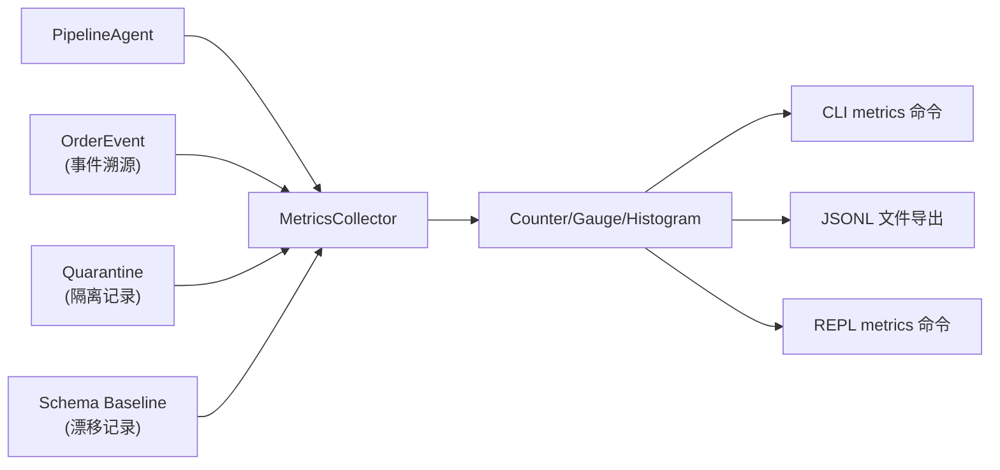

### 12.4 扩展能力（未实现，架构支持）

以下能力在架构上已预留接口，可按需扩展：

| 能力 | 实现方式 | 状态 |
|------|---------|------|
| OpenTelemetry 分布式追踪 | `MetricsCollector` 可对接 OTel SDK | 架构支持，未实现 |
| Prometheus 指标导出 | `snapshot()` 可转换为 Prometheus 格式 | 架构支持，未实现 |
| Grafana 仪表盘 | JSONL 导出可被 Grafana Loki 采集 | 架构支持，未实现 |
| 告警规则引擎 | 基于 histogram 的 p95/p99 阈值触发 | 架构支持，未实现 |

### 12.5 告警规则

| 告警 | 条件 | 严重程度 | 动作 |
|------|------|---------|------|
| quarantine 率突增 | >10% (相对于 7 天均值) | critical | 通知运维 |
| 工具调用失败率 | >5% | critical | 通知运维 + 自动降级 |
| schema 漂移频率 | >3 次/天 | warning | 通知数据工程师 |
| token 消耗异常 | >2x 均值 | warning | 检查是否有循环调用 |
| 延迟 p95 | >30s | warning | 检查工具性能 |

### 6.1 评测维度

| 维度 | 指标 | 目标值 | 方法 |
|------|------|--------|------|
| 意图理解 | plan handler 输出的工具选择准确率 | >90% | 黄金集回归 |
| 工具执行 | 端到端任务成功率 | >85% | 黄金集回归 |
| 错误恢复 | 参数修正后重试成功率 | >70% | 注入错误用例 |
| 能力边界 | 正确识别"做不到"的比例 | >95% | 负面测试集 |
| 延迟 | 端到端响应时间 (p95) | <15s | 线上监控 |
| 成本 | 单次对话平均 token 消耗 | <5000 | 线上监控 |

### 6.2 黄金集设计

```
正常路径 (20+ 用例):
  - 单工具调用: "创建一个明天的会议"
  - 多工具链: "查看我下周的日程，如果有冲突就换时间"
  - 数据导入: "把这个 CSV 导入为日程"

边界情况 (15+ 用例):
  - 无效日期: "2月30日开会"
  - 跨时区: "纽约时间下午3点的会议"
  - 重复创建: 同一请求发送两次

异常情况 (10+ 用例):
  - 意图不匹配: "帮我订机票" (无此工具)
  - 恶意输入: SQL 注入、提示词注入
  - 数据源异常: 文件不存在、格式错误
```

### 6.3 LLM-as-Judge

用另一个 LLM 评判 agent 输出质量：
- 工具选择是否合理
- 参数提取是否正确
- 错误回复是否有帮助
- 血缘标注是否准确

### 6.4 灰度发布

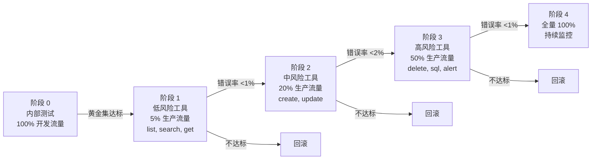

## 13. 项目结构

```
data-pipeline-agent/
├── src/
│   └── data_agent/
│       ├── __init__.py
│       ├── agent.py              # Agent 主循环 (plan → execute → verify)
│       ├── llm_bridge.py         # LLM 推理 ↔ handler 桥接
│       ├── conversation.py       # 对话管理 (多轮上下文)
│       ├── lineage.py            # 血缘查询接口
│       ├── quarantine.py         # 隔离机制 (quarantine rows, 决策矩阵)
│       ├── schema_drift.py       # Schema 漂移检测 (基线管理, diff 算法)
│       ├── deterministic.py      # 确定性校验 (行数/空值/类型/范围)
│       ├── token_budget.py       # Token 预算控制
│       ├── feedback.py           # 反馈闭环
│       ├── prompt_manager.py     # Prompt 版本管理
│       ├── monitoring.py         # 监控与可观测性
│       ├── evaluation.py         # 评测框架
│       └── tools/
│           ├── __init__.py
│           ├── parse_data.py
│           ├── schema_infer.py
│           ├── validate_quality.py
│           ├── transform_data.py
│           ├── query_db.py
│           └── send_alert.py
├── prompts/                      # Prompt 模板 (版本控制)
│   ├── plan_handler.md
│   ├── verify_handler.md
│   ├── system.md
│   └── tool_descriptions/
├── tests/
│   ├── test_tools.py
│   ├── test_agent.py
│   ├── test_lineage.py
│   ├── test_quarantine.py
│   ├── test_schema_drift.py
│   ├── test_deterministic.py
│   ├── test_token_budget.py
│   └── goldens/                  # 黄金集测试用例
│       ├── normal/
│       ├── edge/
│       └── malicious/
├── docs/
│   ├── architecture.md           # 本文档
│   ├── evaluation-plan.md        # 评测计划
│   └── design-rationale.md       # 设计决策说明
├── pyproject.toml
└── README.md
```

## 14. 依赖关系

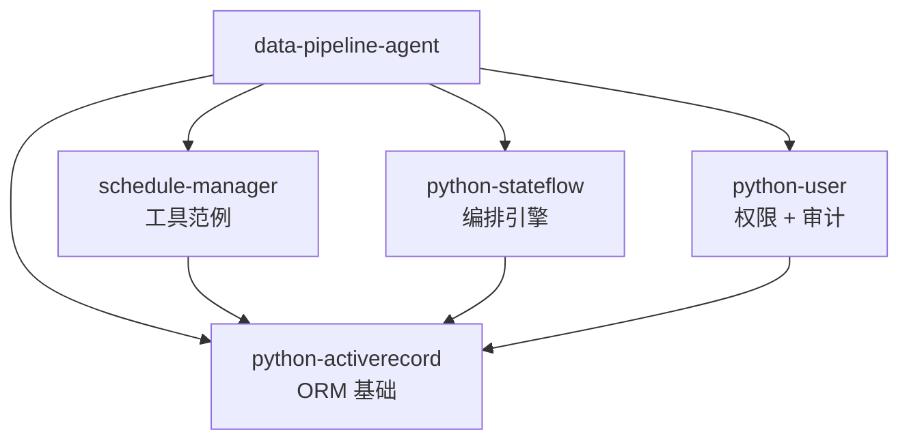

## 15. 与文档建议的对比

| 文档建议 | 本方案 | 优势 |
|---------|--------|------|
| 段页式路由 + 两轮分类调用 | stateflow 动态 append_subprocess | 更通用，不需要预定义类别 |
| embedding 检索匹配工具 | handler 注册表 + LLM 直接推理 | 更简单，可扩展性足够 |
| 人工设计 fallback 链 | saga 自动补偿 | 自动化，不需要预设每种失败路径 |
| 手动记录调用日志 | OrderEvent 事件溯源 | 完整因果链，不只是调用日志 |
| 信任分级 (手动规则) | 信任分级 + RBAC 组合 | 权限控制更精细 |

## 16. 开源依赖

本项目基于 rhosocial 生态的自有开源软件构建：

| 项目 | 简介 | 在本项目中的角色 |
|------|------|-----------------|
| [python-activerecord](https://github.com/rhosocial/python-activerecord) | 独立 ActiveRecord ORM，支持表达式-方言分离、命名连接/表达式/过程/迁移、批量操作、CTE、窗口函数等 | 所有数据访问层的基础，query_db 工具的底层引擎 |
| [python-activerecord-postgres](https://github.com/rhosocial/python-activerecord-postgres) | PostgreSQL 后端适配器 (psycopg3) | 数据库连接与执行 |
| [python-stateflow](https://github.com/rhosocial/python-stateflow) | 状态转换与事件驱动 DAG 编排框架，支持动态图构建、saga 补偿、事件溯源、乐观锁 | Agent 编排引擎，核心循环的底层框架 |
| [python-user](https://github.com/rhosocial/python-user) | 多租户身份认证与 RBAC 授权框架，支持 RBAC1/2、ABAC、ReBAC、组织架构、审计日志 | 权限控制与操作审计 |
| [schedule-manager](https://github.com/vistart/schedule-manager) | 日程管理系统，通过 MCP 和 CLI 暴露给 LLM 调用 | 工具层的具体范例，展示如何将业务系统封装为 agent 工具 |

### 依赖关系图

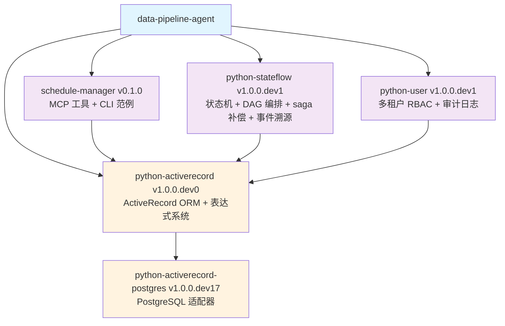

## 17. 待办事项

- [ ] 封装 6 个数据管道工具 handler
- [ ] 实现 agent 主循环 (plan → execute → verify)
- [ ] 实现确定性校验层 (deterministic.py)
- [ ] 实现 Schema 漂移检测 (schema_drift.py + baseline 表)
- [ ] 实现隔离机制 (quarantine.py + quarantine 表)
- [ ] 实现 Token 预算控制 (token_budget.py)
- [ ] 搭建评测框架 + 黄金集
- [ ] 实现血缘查询接口
- [ ] 实现反馈闭环 (feedback.py)
- [ ] 搭建 Prompt 管理框架
- [ ] 搭建监控与可观测性
- [ ] 组装端到端 demo
- [ ] 撰写设计文档 (独立 Markdown)
