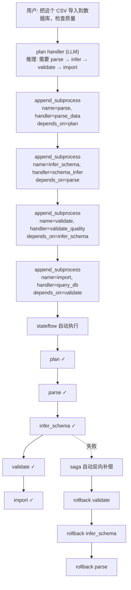

# 工具设计详细规格

## 1. 工具总览

所有工具实现为 stateflow handler，遵循统一接口。

### 接口规范

```python
from rhosocial.stateflow.handlers import SyncSubProcessHandler, HandlerResult

class DataToolHandler(SyncSubProcessHandler):
    """所有数据管道工具的基类"""

    def start(self) -> HandlerResult:
        """
        执行工具逻辑。

        Returns:
            HandlerResult(
                status="success_status",      # 推进到的终态
                payload={...},                # 返回给 LLM 的数据
                event_key="unique_key",       # 幂等键
            )
        """
        raise NotImplementedError

    def rollback(self) -> HandlerResult:
        """
        补偿操作。大部分工具无需回滚。
        """
        return HandlerResult(status="rollback_complete")
```

### 共享能力

```python
# 1. 参数获取: 从 subprocess.context 读取
params = self.subprocess.context

# 2. 日志记录: 通过 OrderEvent 自动记录
# (stateflow 在 publish_event 时自动记录)

# 3. 错误返回: 抛出异常或返回特定 status
# 异常会被 stateflow 捕获并记录为失败事件
```

## 2. 工具详细设计

### 2.1 parse_data — 多格式数据解析

**职责**: 解析 CSV、JSON、Parquet 等格式的数据源，返回结构化数据。

**handler_class**: `"data_agent.tools.parse_data.ParseDataHandler"`

**输入参数** (从 subprocess.context 读取):
```python
{
    "source": str,           # 文件路径、URL、或 base64 数据
    "format": str | None,    # 强制指定格式 (csv/json/parquet)，None 则自动检测
    "encoding": str | None,  # 文件编码，None 则自动检测
    "max_rows": int | None,  # 最大读取行数，None 则全部读取
}
```

**输出** (payload):
```python
{
    "format_detected": "csv",
    "row_count": 150,
    "columns": [
        {"name": "date", "type": "string", "null_rate": 0.0, "unique_count": 120},
        {"name": "revenue", "type": "float", "null_rate": 0.05, "min": 0, "max": 99999},
        {"name": "region", "type": "string", "null_rate": 0.0, "unique_count": 5}
    ],
    "preview": [...],  # 前 5 行数据
    "issues": [
        {"column": "revenue", "type": "warning", "message": "5% null values"}
    ]
}
```

**实现要点**:
- 自动检测格式: 根据文件扩展名 + 内容嗅探
- 流式读取大文件: 使用 pandas chunksize 或 polars streaming
- 错误处理: 格式不匹配时返回 issues 而非抛异常

**rollback**: 无需回滚 (只读操作)。

---

### 2.2 schema_infer — Schema 推理

**职责**: 推断数据源的 schema 定义，包括字段类型、约束、关系。

**handler_class**: `"data_agent.tools.schema_infer.SchemaInferHandler"`

**输入参数**:
```python
{
    "source": str,              # 数据源标识
    "sample_size": int,         # 采样行数 (默认 1000)
    "hints": dict | None,       # 用户提示 (如 "date 列应该是日期类型")
}
```

**输出** (payload):
```python
{
    "schema": {
        "fields": [
            {
                "name": "date",
                "inferred_type": "date",
                "confidence": 0.95,
                "format": "YYYY-MM-DD",
                "nullable": False,
                "constraints": ["unique"]
            },
            {
                "name": "revenue",
                "inferred_type": "decimal",
                "confidence": 0.99,
                "nullable": True,
                "constraints": ["min:0"]
            }
        ],
        "primary_key_suggestion": "date",
        " relationships": []
    },
    "warnings": [
        {"field": "date", "message": "3 rows have non-standard format 'Jan 15'"}
    ]
}
```

**实现要点**:
- 类型推断: 采样 → 尝试转换 → 多数决
- 置信度: 基于成功转换的比例
- 用户 hints 可以覆盖推断结果

**rollback**: 无需回滚。

---

### 2.3 validate_quality — 数据质量验证

**职责**: 检查数据的质量问题。

**handler_class**: `"data_agent.tools.validate_quality.ValidateQualityHandler"`

**输入参数**:
```python
{
    "source": str,                    # 数据源
    "rules": list[dict] | None,       # 自定义规则，None 则自动检测
    "schema_ref": str | None,         # 参考 schema (来自 schema_infer 的输出)
}
```

**输出** (payload):
```python
{
    "overall_score": 0.87,            # 0-1 质量评分
    "total_rows": 150,
    "issues": [
        {
            "severity": "critical",
            "column": "date",
            "type": "invalid_format",
            "affected_rows": 5,
            "samples": ["N/A", "unknown", "2026/13/01"],
            "suggestion": "Drop or replace with NULL"
        },
        {
            "severity": "warning",
            "column": "revenue",
            "type": "null_values",
            "affected_rows": 8,
            "null_rate": 0.053,
            "suggestion": "Fill with mean or drop"
        },
        {
            "severity": "info",
            "column": "region",
            "type": "low_cardinality",
            "unique_values": 3,
            "suggestion": "Consider using ENUM type"
        }
    ],
    "statistics": {
        "completeness": 0.947,
        "consistency": 0.92,
        "accuracy": 0.88,
        "timeliness": 1.0
    }
}
```

**自动检测规则**:
- 空值率 > 阈值
- 类型不一致 (同一列混合类型)
- 范围异常 (负数出现在应该为正数的列)
- 重复行
- 格式不一致 (日期列多种格式)

**rollback**: 无需回滚。

---

### 2.4 transform_data — 数据转换

**职责**: 清洗和转换数据。

**handler_class**: `"data_agent.tools.transform_data.TransformDataHandler"`

**输入参数**:
```python
{
    "source": str,                    # 数据源
    "operations": list[dict],         # 转换操作列表
    "output_format": str,             # 输出格式 (csv/json/parquet)
    "output_path": str | None,        # 输出路径，None 则内存中
}
```

**转换操作类型**:
```python
# 重命名列
{"op": "rename", "mapping": {"old_name": "new_name"}}

# 类型转换
{"op": "cast", "column": "date", "target_type": "date", "format": "YYYY-MM-DD"}

# 填充缺失值
{"op": "fill_null", "column": "revenue", "strategy": "mean"}

# 过滤行
{"op": "filter", "expression": "revenue > 0"}

# 去重
{"op": "dedup", "columns": ["date", "region"]}

# 添加计算列
{"op": "add_column", "name": "profit", "expression": "revenue - cost"}

# 标准化
{"op": "normalize", "column": "revenue", "method": "min_max"}
```

**输出** (payload):
```python
{
    "output_path": "/tmp/transformed_data.csv",
    "row_count_before": 150,
    "row_count_after": 142,
    "operations_applied": [...],
    "changes_summary": "Removed 8 duplicate rows, filled 5 null values with mean"
}
```

**实现要点**:
- 操作按顺序执行 (pipeline 模式)
- 每步操作产生中间结果 (可审计)
- 支持 dry-run 模式 (只输出计划不执行)

**rollback**: 如果输出到文件，删除输出文件。

---

### 2.5 query_db — 数据库查询与操作

**职责**: 通过 ORM 进行数据库查询、分析、批量操作，不直接执行原始 SQL。

**handler_class**: `"data_agent.tools.query_db.QueryDBHandler"`

**设计原则**:
- 所有操作通过 python-activerecord 的表达式系统构建，不拼接原始 SQL
- 参数化 + 类型化，杜绝注入风险
- 每次操作生成可审计的表达式日志 (等价 SQL + 参数)
- 支持 dry-run 模式，预览 SQL 不执行

**操作模式**:

#### 模式 1: 模型查询 (Model Query)

通过 ActiveRecord 查询 API 进行数据检索。

```python
{
    "mode": "model_query",
    "connection": "named_connection_fqn",  # 命名连接
    "model": "schedule_manager.model.Schedule",  # 模型类路径
    "operations": [
        {"op": "where", "field": "status", "op": "==", "value": "pending"},
        {"op": "where", "field": "priority", "op": "<=", "value": 2},
        {"op": "order_by", "field": "due_time", "direction": "asc"},
        {"op": "limit", "value": 20},
    ],
    "select": ["id", "title", "due_time", "priority"],  # 可选，投影
    "dry_run": false
}
```

**等价 ORM 调用**:
```python
Schedule.query() \
    .where((Schedule.c.status == "pending") & (Schedule.c.priority <= 2)) \
    .order_by((Schedule.c.due_time, "ASC")) \
    .limit(20) \
    .all()
```

#### 模式 2: 命名表达式 (Named Expression)

调用预定义的、经过测试的命名查询函数。

```python
{
    "mode": "named_expression",
    "connection": "named_connection_fqn",
    "expression": "mypackage.expressions.overdue_tasks",  # FQN
    "params": {"threshold_days": 7},
    "dry_run": false
}
```

**底层机制**: `resolve_named_expression(fqn, dialect, params)` → 执行表达式 → 返回结果

#### 模式 3: 命名过程 (Named Procedure)

编排多步骤数据库操作，支持条件逻辑和并行执行。

```python
{
    "mode": "named_procedure",
    "connection": "named_connection_fqn",
    "procedure": "mypackage.procedures.data_quality_check",  # FQN
    "params": {"table": "schedules", "min_score": 0.8},
    "transaction_mode": "auto",  # auto | step | none
    "dry_run": false
}
```

**底层机制**: `ProcedureRunner` 执行 → `ProcedureContext` 管理步骤间数据传递 → `ProcedureResult` 返回

#### 模式 4: 聚合分析 (Aggregate)

无需定义模型，直接通过表达式进行聚合分析。

```python
{
    "mode": "aggregate",
    "connection": "named_connection_fqn",
    "table": "schedules",
    "aggregations": [
        {"func": "count", "alias": "total"},
        {"func": "count", "filter": {"field": "status", "op": "==", "value": "completed"}, "alias": "completed"},
        {"func": "avg", "field": "priority", "alias": "avg_priority"},
    ],
    "group_by": ["status"],
    "having": {"field": "total", "op": ">", "value": 5},
    "dry_run": false
}
```

#### 模式 5: 批量操作 (Batch DML)

大批量数据的 INSERT/UPDATE/DELETE，支持分批提交。

```python
{
    "mode": "batch_dml",
    "connection": "named_connection_fqn",
    "operation": "update",  # insert | update | delete
    "model": "schedule_manager.model.Schedule",
    "filter": {"field": "status", "op": "==", "value": "pending"},
    "updates": {"status": "cancelled"},  # 仅 update 模式
    "batch_size": 500,
    "commit_mode": "whole",  # whole | per_batch
    "dry_run": false
}
```

#### 模式 6: 集合运算 (Set Operation)

UNION / INTERSECT / EXCEPT 多查询结果合并。

```python
{
    "mode": "set_operation",
    "connection": "named_connection_fqn",
    "operation": "union",  # union | intersect | except
    "queries": [
        {"model": "Schedule", "operations": [{"op": "where", "field": "status", "op": "==", "value": "pending"}]},
        {"model": "Schedule", "operations": [{"op": "where", "field": "status", "op": "==", "value": "in_progress"}]},
    ],
    "dry_run": false
}
```

#### 模式 7: Schema 内省 (Introspect)

查询数据库结构，不操作数据。

```python
{
    "mode": "introspect",
    "connection": "named_connection_fqn",
    "target": "tables",  # tables | table_info | columns
    "table": "schedules"  # 可选，table_info 时必填
}
```

**输出** (所有模式通用):
```python
{
    "mode": "model_query",             # 回显操作模式
    "sql_preview": "SELECT id, title, due_time FROM schedules WHERE status = $1 AND priority <= $2 ORDER BY due_time ASC LIMIT 20",
    "sql_params": ["pending", 2],
    "columns": ["id", "title", "due_time"],
    "rows": [...],
    "row_count": 15,
    "truncated": False,
    "execution_time_ms": 45,
    "expression_fqn": "model_query:schedule_manager.model.Schedule",  # 可审计标识
    "dry_run": False
}
```

**安全约束**:
- 不接受原始 SQL 字符串，所有操作通过表达式 API 构建
- 参数化查询 (表达式系统自动处理)
- 命名连接控制数据库访问权限
- dry-run 模式可预览 SQL 而不执行
- batch_dml 操作需要显式确认 (通过 stateflow 的 confirm 机制)
- 操作日志自动记录到 OrderEvent (表达式 + 参数 + 结果摘要)

**rollback**: 
- 查询模式: 无需回滚 (只读)
- batch_dml 模式: 如果 commit_mode="whole" 且操作失败，事务自动回滚；如果 commit_mode="per_batch"，已提交的批次不可回滚，需通过反向操作补偿

---

### 2.6 send_alert — 告警通知

**职责**: 发送告警通知。

**handler_class**: `"data_agent.tools.send_alert.SendAlertHandler"`

**输入参数**:
```python
{
    "channel": str,           # 通知渠道 (email/webhook/log)
    "recipients": list[str],  # 接收方
    "subject": str,           # 主题
    "body": str,              # 内容
    "severity": str,          # 严重程度 (info/warning/critical)
    "metadata": dict | None,  # 附加信息
}
```

**输出** (payload):
```python
{
    "sent": True,
    "message_id": "alert-20260905-001",
    "channel": "email",
    "recipients_count": 3
}
```

**实现要点**:
- 支持多渠道: email (SMTP), webhook (HTTP), log (本地日志)
- 去重: 相同内容 5 分钟内不重复发送
- 限流: 每分钟最多发送 N 条

**rollback**: 无法撤回已发送的通知，但可以发送更正通知。

## 3. 工具与 stateflow 的集成

### 3.1 注册流程

```python
from rhosocial.stateflow.registry import HandlerRegistry

registry = HandlerRegistry(allow_dynamic_import=True)

# 注册所有工具
registry.register("parse_data", ParseDataHandler)
registry.register("schema_infer", SchemaInferHandler)
registry.register("validate_quality", ValidateQualityHandler)
registry.register("transform_data", TransformDataHandler)
registry.register("query_db", QueryDBHandler)
registry.register("send_alert", SendAlertHandler)
```

### 3.2 动态编排流程



### 3.3 错误处理集成

```python
class ParseDataHandler(SyncSubProcessHandler):
    def start(self) -> HandlerResult:
        try:
            data = self._parse(self.subprocess.context["source"])
            return HandlerResult(status="parsed", payload=data)
        except FileNotFoundError:
            # 文件不存在 → 返回错误状态，LLM 决定是否重试
            return HandlerResult(
                status="parse_failed",
                payload={"error": "File not found", "recoverable": True}
            )
        except FormatMismatchError as e:
            # 格式不匹配 → 返回详细信息，LLM 决定如何处理
            return HandlerResult(
                status="parse_failed",
                payload={"error": str(e), "recoverable": True, "suggestion": "Try specifying format explicitly"}
            )
```

## 4. 测试策略

每个工具需要：

1. **单元测试**: 正常输入 → 正确输出
2. **边界测试**: 空输入、超大输入、特殊字符
3. **异常测试**: 文件不存在、格式错误、权限不足
4. **集成测试**: 工具链 (parse → validate → transform)
5. **安全测试**: SQL 注入、路径遍历、XSS
