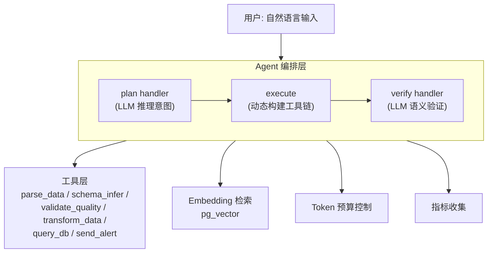

# Adaptive Data Pipeline Agent (DPA)

LLM-driven data pipeline agent that reasons about data quality and orchestrates ETL tools via MCP.

## Quick Start

```bash
# Clone
git clone https://github.com/vistart/data-pipeline-agent.git
cd data-pipeline-agent

# Setup
python3 -m venv .venv3.14-ubuntu26.04
source .venv3.14-ubuntu26.04/bin/activate
pip install -i https://mirrors.aliyun.com/pypi/simple/ -r requirements.txt

# Configure
cp .env.example .env
# Edit .env with your API key

# Run
PYTHONPATH=src python -m dpa.cli.main run
```

## Demo Scripts

```bash
bash scripts/run-simple-parse.sh      # Simple CSV parse
bash scripts/run-drift-demo.sh        # Schema drift detection
bash scripts/run-quality-check.sh     # Data quality check
bash scripts/run-db-analysis.sh       # Database query analysis
bash scripts/run-all.sh               # Run all scenarios
```

## Architecture

See [architecture.md](.claude/plan/2026-09-05/architecture.md) for the full system design (17 sections, ~900 lines).

### System Overview



## Built on rhosocial Ecosystem

| Project | Description | Role |
|---------|-------------|------|
| [python-activerecord](https://github.com/rhosocial/python-activerecord) | ActiveRecord ORM with expression-dialect separation | Data access layer |
| [python-activerecord-postgres](https://github.com/rhosocial/python-activerecord-postgres) | PostgreSQL adapter (psycopg3) + pg_vector | Database + vector search |
| [python-stateflow](https://github.com/rhosocial/python-stateflow) | State machine + DAG orchestration + saga + event sourcing | Agent orchestration |
| [python-user](https://github.com/rhosocial/python-user) | Multi-tenant RBAC1/2 + ABAC + ReBAC + audit | Auth & permissions |
| [schedule-manager](https://github.com/vistart/schedule-manager) | Schedule management (MCP + CLI) | Tool layer example |

## Key Features

### Tools

| Tool | Function |
|------|----------|
| `parse_data` | Parse CSV/JSON files |
| `schema_infer` | Schema inference + drift detection |
| `validate_quality` | Data quality checks (nulls, types, ranges) |
| `transform_data` | Rename, cast, filter, aggregate |
| `query_db` | PostgreSQL ORM queries (7 modes) |
| `send_alert` | Alert notifications (console/file/log) |

### Reliability

- **LLM API retry/fallback** — exponential backoff + 4-model fallback chain
- **3-layer corruption defense** — deterministic → statistical → LLM semantic
- **Quarantine mechanism** — row-level isolation with approval workflow
- **Schema drift detection** — baseline management + diff algorithm
- **Token budget control** — phase-based degradation + history truncation

### Observability

- **Metrics collection** — counters, histograms (latency, tokens, tool calls)
- **CLI exposure** — `dpa metrics` command
- **JSONL export** — for external analysis

### Evaluation

- **21 golden test cases** — 10 normal + 6 edge + 5 malicious
- **4 demo scenarios** — with executable scripts
- **LLM-as-Judge ready** — structured output for automated evaluation

## Project Structure

```
data-pipeline-agent/
├── src/dpa/
│   ├── core/           # PipelineAgent (main loop)
│   ├── tools/          # 6 tool implementations
│   ├── sessions/       # JSONL session persistence
│   ├── cli/            # CLI entry point (click)
│   ├── models.py       # ORM models (Quarantine, Event, Baseline)
│   ├── embedding.py    # pg_vector tool matching
│   ├── token_budget.py # Token budget control
│   ├── metrics.py      # Metrics collection
│   ├── quarantine.py   # Quarantine mechanism
│   ├── events.py       # Event sourcing
│   ├── schema_baseline.py # Schema baseline management
│   └── anomaly_detection.py # Statistical anomaly detection
├── data/               # Sample data files
├── examples/           # Scenario documentation
├── scripts/            # Demo scripts
├── tests/              # Golden test cases
├── configs/            # LLM provider configs
├── docs/               # Deployment + interview docs
└── sessions/           # Session logs (auto-generated)
```

## Documentation

- [Deployment Guide](docs/deployment.md) — Setup from scratch
- [Interview Delivery](docs/interview-delivery.md) — Exam requirements mapping
- [Architecture](.claude/plan/2026-09-05/architecture.md) — Full system design
- [Evaluation Plan](.claude/plan/2026-09-05/evaluation-plan.md) — Testing framework
- [Tool Design](.claude/plan/2026-09-05/tool-design.md) — Tool specifications

## License

Apache 2.0
